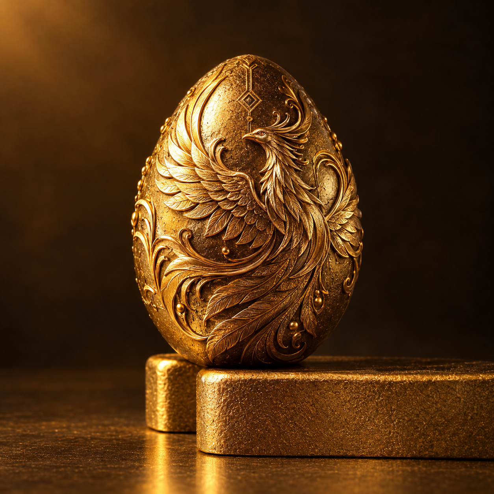

````markdown
<div align="center">

# 🥚 Golden-Egg

### Digital Art NFT Collection

<p>
  
  
</p>

**2 / 3 artworks minted · ERC-721 · Ethereum Sepolia Testnet · IPFS**

<p>
  <a href="https://mohammadyadollahi-netizen.github.io/golden-egg-gallery/">
    <strong>🌐 Official Gallery</strong>
  </a>
  &nbsp;•&nbsp;
  <a href="https://sepolia.etherscan.io/address/0x389C1Dc0Df1eE889ac9EefCE84787E83F9069167">
    <strong>⛓️ Smart Contract</strong>
  </a>
</p>

</div>

---

## ✨ About

**Golden-Egg** is a digital art NFT collection built with:

- **ERC-721**
- **Ethereum Sepolia Testnet**
- **IPFS-based metadata**
- **GitHub Pages gallery**
- On-chain ownership and token URI verification

The initial collection is planned as **3 artworks**.

Current status:

| Collection | Status |
|---|---|
| 🥚 Golden-Egg #1 | ✅ Minted |
| 🥚 Golden-Egg #2 | ✅ Minted |
| 🥚 Golden-Egg #3 | 🔜 Future |

---

## 🖼️ Collection

### Golden-Egg #1

<p align="center">
  
</p>

| Property | Value |
|---|---|
| Token ID | `1` |
| Standard | `ERC-721` |
| Network | `Ethereum Sepolia` |
| Metadata CID | `bafkreickagoqhrpskvqyww4awlm66xmljibtpjeeawo3dzc6jdxz5yr2xa` |
| Image CID | `bafybeibahee5qhjn5zh6x4xmx2lno26j3goqx2rschijikx4eig3sd5r6q` |
| Owner | `0x71C508b0B799D5941B91DA7966029C53c1d6F692` |

**Links**

- [Metadata](https://dweb.link/ipfs/bafkreickagoqhrpskvqyww4awlm66xmljibtpjeeawo3dzc6jdxz5yr2xa)
- [IPFS Image](https://dweb.link/ipfs/bafybeibahee5qhjn5zh6x4xmx2lno26j3goqx2rschijikx4eig3sd5r6q)
- [Etherscan](https://sepolia.etherscan.io/token/0x389C1Dc0Df1eE889ac9EefCE84787E83F9069167?a=1)

---

### Golden-Egg #2

<p align="center">
  
</p>

| Property | Value |
|---|---|
| Token ID | `2` |
| Standard | `ERC-721` |
| Network | `Ethereum Sepolia` |
| Metadata CID | `bafkreihytiwjjsw4nr3dvgh5dyyzxw3qqs6jrbmomhxdioxrbhtblgw4t4` |
| Image CID | `bafybeihra6q5yvnyitntkpt3gd5eynkuzjhmsqfsvcbmuopvapmyqz6dku` |
| Owner | `0x71C508b0B799D5941B91DA7966029C53c1d6F692` |
| Mint Transaction | `0xcf29b6aee1de1efb2e6e28710c0f97c2d1781ad2543483ee047499c109c33794` |

**Links**

- [Metadata](https://dweb.link/ipfs/bafkreihytiwjjsw4nr3dvgh5dyyzxw3qqs6jrbmomhxdioxrbhtblgw4t4)
- [IPFS Image](https://dweb.link/ipfs/bafybeihra6q5yvnyitntkpt3gd5eynkuzjhmsqfsvcbmuopvapmyqz6dku)
- [Etherscan](https://sepolia.etherscan.io/token/0x389C1Dc0Df1eE889ac9EefCE84787E83F9069167?a=2)
- [Transaction](https://sepolia.etherscan.io/tx/0xcf29b6aee1de1efb2e6e28710c0f97c2d1781ad2543483ee047499c109c33794)

---

## ⛓️ Smart Contract

| Property | Value |
|---|---|
| Collection | `Golden-Egg` |
| Symbol | `GEGG` |
| Standard | `ERC-721` |
| Network | `Ethereum Sepolia Testnet` |
| Contract | `0x389C1Dc0Df1eE889ac9EefCE84787E83F9069167` |
| Owner | `0x71C508b0B799D5941B91DA7966029C53c1d6F692` |

**Contract:**  
https://sepolia.etherscan.io/address/0x389C1Dc0Df1eE889ac9EefCE84787E83F9069167

---

## 🔗 IPFS

Golden-Egg uses IPFS for NFT metadata and artwork references.

### Golden-Egg #1

```text
Metadata:
ipfs://bafkreickagoqhrpskvqyww4awlm66xmljibtpjeeawo3dzc6jdxz5yr2xa

Image:
ipfs://bafybeibahee5qhjn5zh6x4xmx2lno26j3goqx2rschijikx4eig3sd5r6q
````

### Golden-Egg #2

```text
Metadata:
ipfs://bafkreihytiwjjsw4nr3dvgh5dyyzxw3qqs6jrbmomhxdioxrbhtblgw4t4

Image:
ipfs://bafybeihra6q5yvnyitntkpt3gd5eynkuzjhmsqfsvcbmuopvapmyqz6dku
```

---

## ✅ Verification

The current NFTs have been checked using the smart contract's public read functions.

### Token #1

```text
tokenURI(1)

ipfs://bafkreickagoqhrpskvqyww4awlm66xmljibtpjeeawo3dzc6jdxz5yr2xa
```

```text
ownerOf(1)

0x71C508b0B799D5941B91DA7966029C53c1d6F692
```

### Token #2

```text
tokenURI(2)

ipfs://bafkreihytiwjjsw4nr3dvgh5dyyzxw3qqs6jrbmomhxdioxrbhtblgw4t4
```

```text
ownerOf(2)

0x71C508b0B799D5941B91DA7966029C53c1d6F692
```

---

## 🌐 Official Gallery

The current collection is presented through GitHub Pages:

### https://mohammadyadollahi-netizen.github.io/golden-egg-gallery/

The gallery includes:

* Golden-Egg #1
* Golden-Egg #2
* Collection progress
* IPFS metadata links
* Smart contract information
* Etherscan links

---

## 📁 Repository Structure

```text
golden-egg-gallery/
│
├── index.html
├── README.md
├── golden-egg-1.png
└── golden-egg-2.png
```

---

## 🗺️ Roadmap

### Phase 1 — Foundation ✅

* [x] Create Golden-Egg collection concept
* [x] Create #1 artwork
* [x] Create #2 artwork
* [x] Upload artwork to IPFS
* [x] Create NFT metadata
* [x] Deploy ERC-721 contract
* [x] Mint Token #1
* [x] Mint Token #2
* [x] Verify `tokenURI`
* [x] Verify ownership
* [x] Build GitHub Pages gallery
* [x] Build project README

### Phase 2 — Collection Expansion 🔜

* [ ] Create Golden-Egg #3
* [ ] Upload #3 artwork to IPFS
* [ ] Create standardized #3 metadata
* [ ] Mint Token #3
* [ ] Add #3 to Gallery
* [ ] Complete initial 3-piece collection

### Phase 3 — Production Preparation

* [ ] Review final collection structure
* [ ] Review smart-contract deployment strategy
* [ ] Prepare production metadata
* [ ] Prepare production gallery
* [ ] Evaluate marketplace compatibility
* [ ] Consider Ethereum Mainnet deployment

---

## 📊 Current Project Status

| Category             | Status             |
| -------------------- | ------------------ |
| Collection           | `Golden-Egg`       |
| NFTs Minted          | `2`                |
| Initial Planned Size | `3`                |
| Blockchain           | `Ethereum Sepolia` |
| Standard             | `ERC-721`          |
| Metadata             | `IPFS`             |
| Gallery              | ✅ Online           |
| GitHub Repository    | ✅ Public           |
| Golden-Egg #3        | 🔜 Future          |

---

## ⚠️ Network Notice

The current Golden-Egg contract is deployed on the **Ethereum Sepolia Testnet**.

This is a development/testnet collection. A future Ethereum Mainnet deployment would be a separate production deployment and should not be treated as the same contract.

---

## 🔗 Project Links

**GitHub Repository**
https://github.com/mohammadyadollahi-netizen/golden-egg-gallery

**Official Gallery**
https://mohammadyadollahi-netizen.github.io/golden-egg-gallery/

**Smart Contract**
https://sepolia.etherscan.io/address/0x389C1Dc0Df1eE889ac9EefCE84787E83F9069167

---

<div align="center">

### 🥚 Golden-Egg

**Digital Art · ERC-721 · IPFS · Ethereum**

*Collection in progress — 2 / 3*

</div>

## 📚 Documentation

- [Smart Contract Documentation](./docs/contract.md)
- [Collection Documentation](./docs/collection.md)
- [Metadata Documentation](./docs/metadata.md)
